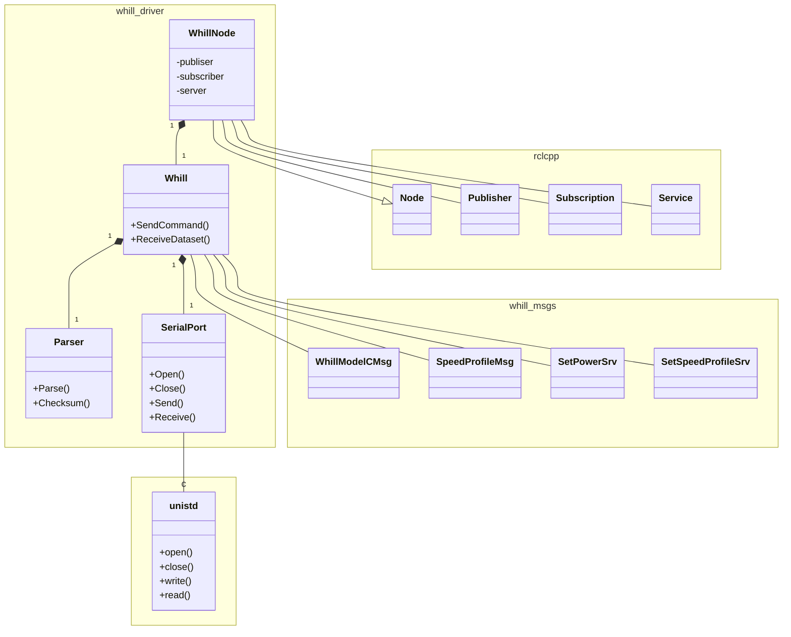

# whill_driver

## About
The "whill_driver" is a ROS2 package for WHILL Model CR2 controller.

## Package Structure

| Class name | Explanation |
|:---|:---|
| WhillNode | This class provides ROS2 Node, and has responsible for RCLCPP abstraction. |
| Whill | This class has WHILL Model CR2 domain. So, this class can understand control commands and WHILL state datasets. |
| Parser | This class has the ability to parse packets from WHILL. |
| SerialPort | This class provides serial port driver, and has responsible for hardware abstraction. |

**Note:** [whill_msgs](https://github.com/WHILL/ros2_whill_interfaces) is not provided by this repository.

## License

Copyright (c) 2024 WHILL, Inc.

Released under the [MIT license](https://opensource.org/licenses/mit-license.php)
